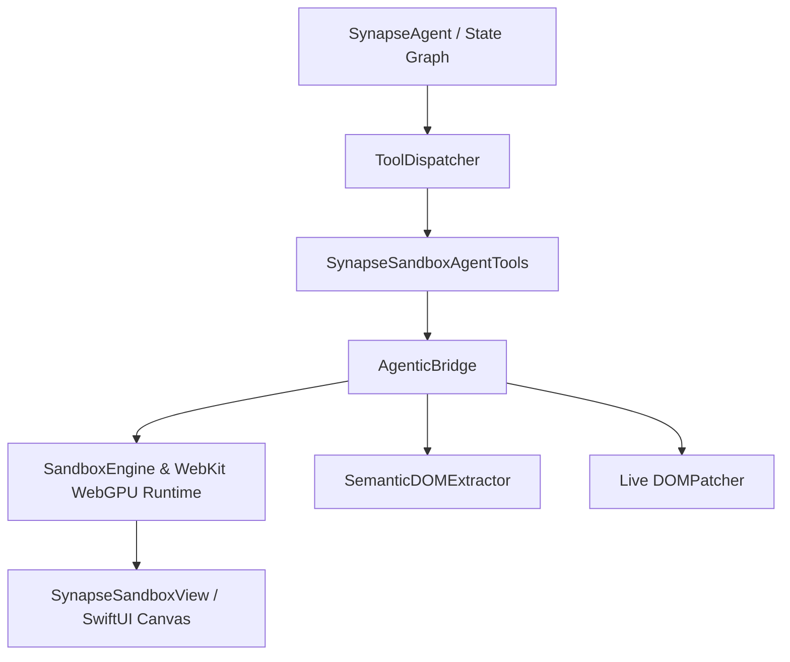

# SynapseSandbox Agent Integration Guide

This guide details how **SynapseSandbox** acts as the live code execution environment, semantic DOM feedback engine, and interactive SwiftUI canvas for **SynapseAgent**.

---

## 🏛️ Architecture Overview



---

## 🛠️ Sandbox Agent Tools

- `sandbox_render_web_app`: Render or completely reload the HTML5/JS/CSS app.
- `sandbox_patch_dom`: Sub-millisecond JS/CSS delta updates without full reload.
- `sandbox_inspect_dom`: Captures token-optimized Markdown/JSON representation of the live UI for agent context.
- `sandbox_write_file`: Write virtual in-memory files (HTML, CSS, JS, WASM).
- `sandbox_read_file`: Inspect virtual workspace files.
- `sandbox_list_files`: Query all files in the virtual workspace.

---

## 🚀 Example: Connecting to SynapseAgent

```swift
import SynapseAgent
import SynapseSandbox

var workspace = SandboxWorkspace.defaultTemplate(name: "AI Canvas")

let renderTool = ClosureTool(
    name: "sandboxRender",
    description: "Renders HTML in embedded sandbox",
    parametersSchema: [
        "type": AnySendable("object"),
        "properties": AnySendable([
            "html": AnySendable(["type": AnySendable("string"), "description": AnySendable("HTML content")])
        ]),
        "required": AnySendable([AnySendable("html")])
    ]
) { args in
    try await SynapseSandboxAgentTools.handleToolCall(
        workspace: &workspace,
        toolName: "sandbox_render_web_app",
        argumentsJSON: args
    )
}

let registry = ToolRegistry()
registry.register(renderTool)
```
